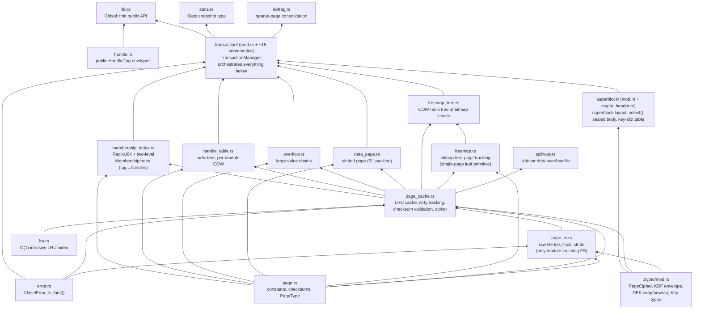
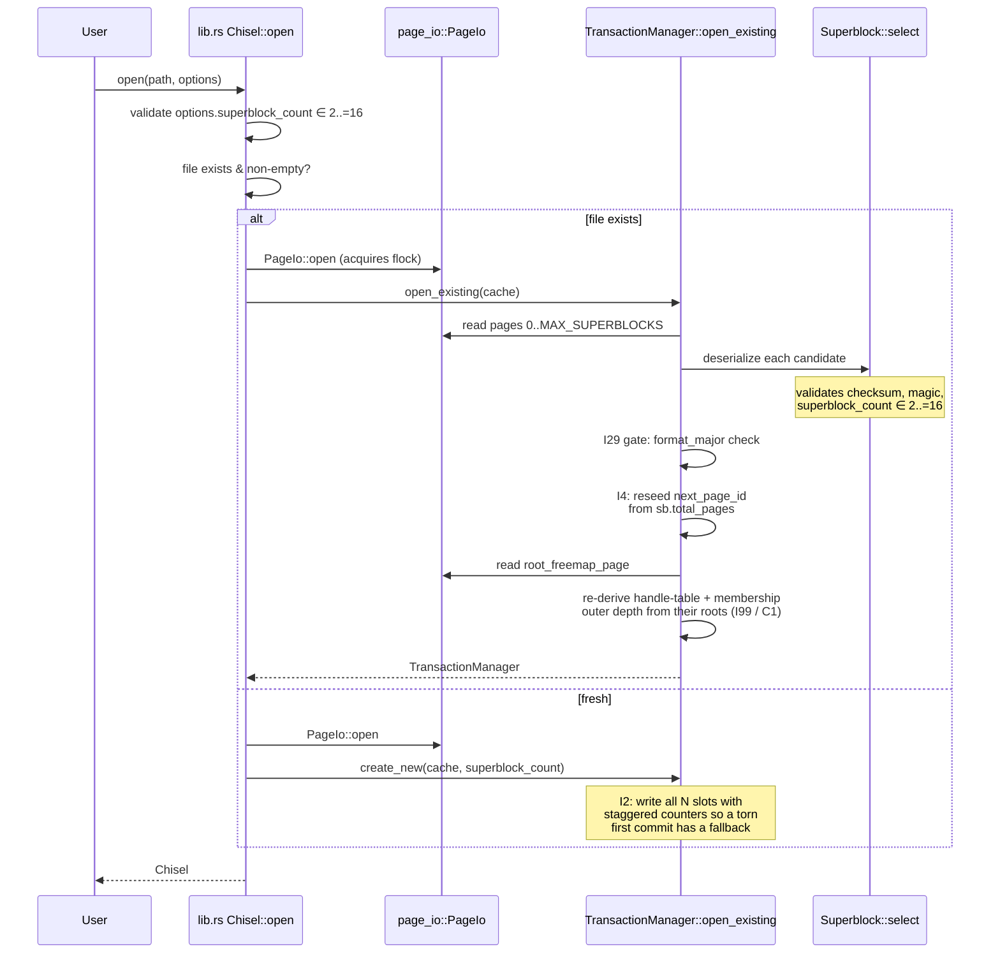
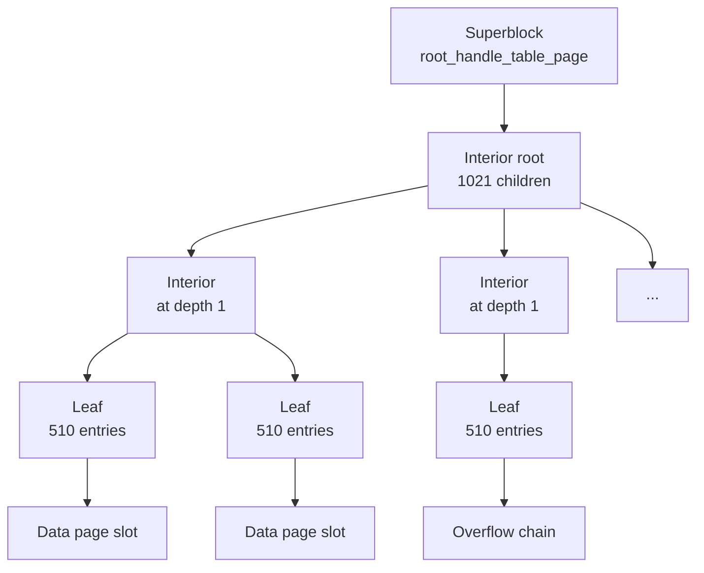

# Chisel — Architecture and On-Disk Format

This document is the cold-start reference for someone (human or AI) picking up the Chisel codebase in a context-free session. It is a compressed map of the layers, the exact on-disk byte format, the load-bearing invariants, and the landmines. Read it whole at the start of a session. For *what Chisel does* and how to use it, see [`README.md`](README.md). For the running decision log — open issues, closed issues, every design tradeoff with date-stamped rationale — see [`ISSUES.md`](ISSUES.md).

For the theory of operation and the rationale behind these decisions — why shadow-paging over WAL, the rejected alternatives, the implementation history — see [`THEORY.md`](THEORY.md).

This is a living document; update it when the architecture changes. Decisions documented here should be supportable by the code at the time you read it — if a claim and the code disagree, trust the code and update the doc.

## Table of contents

1. [Design commitments](#design-commitments)
2. [Commenting standards](#commenting-standards)
3. [Layer model](#layer-model)
4. [Commit protocol](#commit-protocol)
5. [Recovery on open](#recovery-on-open)
6. [On-disk format](#on-disk-format)
7. [Cross-cutting concepts](#cross-cutting-concepts)
   - [On-disk encryption](#on-disk-encryption)
8. [Glossary](#glossary)

---

## Design commitments

Three enforced facts shape everything else (rationale in THEORY.md):

- **Single-writer, embedded.** Exactly one process owns the file at a time, enforced by `flock`. The Rust API is `&mut self` for every mutator; no internal locking, no concurrent transactions, no MVCC.
- **Shadow paging, not WAL.** Every write goes to a fresh page; the previously-committed superblock keeps pointing at the previous intact pages until commit swaps in a new superblock. Recovery is "pick the winning superblock" — no log to replay.
- **Durability over performance.** Every commit performs two (three with the I28 pre-drain) `fsync` calls (data, then superblock). Every page carries an XXH3 checksum validated on load. Any `fsync` failure poisons the manager (fsyncgate makes retry unsafe).

---

## Commenting standards

Comments should explain choices, tradeoffs, higher-level algorithms, constraints, and invariants — not restate what the code does. Each file should have a brief header noting its role in the overall system. Emphasize non-obvious side effects, ordering dependencies, and intentional design decisions. The audience is a reader (human or AI) encountering this code for the first time.

Concretely:

- A doc comment on a public item should answer "why does this exist, and what would a caller need to know to use it correctly?" — not "what does each line of the body do?"
- An inline comment should call out something a careful reader couldn't infer from the surrounding code: a non-obvious invariant, an ordering dependency on an earlier statement, a workaround for a known platform quirk, or a deliberate departure from the obvious idiom.
- Module headers should state the module's role in the layer model (which layer? what does it depend on? what depends on it?) and the load-bearing invariants the rest of the module assumes.
- `unsafe` blocks must carry a `// SAFETY:` comment naming each invariant being upheld. This is checked by convention, not by clippy — the only `unsafe` in the core engine (`page_io.rs::try_lock`) and the only `unsafe` in the bench harness (`chisel_engine.rs::delete_many`) are both small enough that a missing SAFETY comment is a real review finding.

When a comment and the code disagree, the comment is stale by default. Update or remove it — silent drift between comments and behaviour is one of the most common ways a codebase becomes hard to evolve.

---

## Layer model

Chisel's modules form a strict bottom-up dependency graph: each layer only depends on layers below it, never sideways or upward. Read the codebase in dependency order and you never have to forward-reference.



### Module responsibilities at a glance

| Layer | Module | Responsibility | Key invariant |
|---|---|---|---|
| 1 | `page.rs` | Page size, type tags, header sizes, magic, format-version constants, XXH3 checksum primitives. | `PAGE_SIZE = 8192`; checksum lives in the last 8 bytes; little-endian on disk. |
| 1 | `error.rs` | `ChiselError` enum, `is_fatal()` classifier (operational vs fatal). | Fatal variants poison the manager (I1). |
| 1 | `handle.rs` | Public `Handle` (`u64`) and `Tag` (`NonZeroU32`) newtypes for the API surface. | `#[repr(transparent)]` on `Handle` is load-bearing — the bench adapter transmutes `&[u64]` → `&[Handle]` (I120/I126). Lives ABOVE the engine; the engine stays raw-integer. |
| 1 | `crypto/mod.rs` | At-rest crypto core: XChaCha20-Poly1305 `PageCipher` (page + body seal/open), envelope KDF (HKDF-SHA256 raw / Argon2id passphrase), DEK wrap/unwrap, zeroizing `Key`/`Argon2Params`. | Standalone — touches no engine layer. Only vetted RustCrypto primitives; all randomness OS-sourced. `ENC_PAGE_SIZE = 8232`, `NONCE_LEN = 24`, `TAG_LEN = 16`, `DEK_LEN = 32`. |
| 1 | `superblock/` (`mod.rs` + `crypto_header.rs`) | In-memory `Superblock` struct, `serialize`/`deserialize`, `select()` across N candidate slots; `crypto_header.rs` holds the plaintext crypto-header + 8-slot key-slot table and the sealed-body decrypt path. | Magic + checksum + `superblock_count ∈ 2..=16` filter slots before tie-breaking by `txn_counter`. Encrypted DBs seal the sensitive body under the DEK. |
| 2 | `page_io.rs` | Raw `pread`/`pwrite` of fixed-**stride** pages, exclusive `flock`, `fsync`, in-memory `Vec<u8>` backing. Tracks cumulative successful `fsync_calls` via `Cell<u64>`. Stride = `PAGE_SIZE` (plaintext) or `ENC_PAGE_SIZE` (encrypted), set once via `set_stride`. | The **only** module that touches the filesystem; crypto-agnostic (moves `stride`-byte blobs at `page_id * stride`). |
| 2 | `lru.rs` | O(1) intrusive doubly-linked LRU index over `u64` page ids (`FxHashMap`-backed, I77). | Replaces the O(n) `VecDeque::retain` LRU; consumed only by `page_cache`. |
| 3 | `page_cache.rs` | LRU cache over `PageIo`, dirty tracking, checksum validation on load, `PageCipher` seal/open at the I/O boundary, spillway overflow, `CacheFull`/`SpillwayFull` errors. Owns three `Cell<u64>` engine-activity counters (cache hits/misses, pages allocated) and aggregates them with `PageIo::fsync_count` into `counters()`. | Soft eviction at `max_pages`; dirty overflow spills to a sidecar (cap = `spillway_max_bytes`); `CacheFull` at strict `max_pages` when spillway disabled (`spillway_max_bytes=0`); checksums verified on disk LOAD only. |
| 3 | `spillway.rs` | Sidecar `<db>.spillway` file for dirty pages the LRU is forced to spill. Per-slot XXH3 over `page_id ‖ payload`; crypto-agnostic (plaintext 8192-byte page or sealed 8232-byte blob). | Never `fsync`ed; truncated at open/commit/rollback — its content is always discardable uncommitted state. |
| 4 | `freemap.rs` | Single-page bitmap primitive: `allocate_first` / `mark_free` on one `[u8; PAGE_SIZE]` buffer. | Pure buffer manipulation; no cache or I/O. Composed into the multi-page tree by `freemap_tree.rs`. |
| 4 | `freemap_tree.rs` | COW radix tree of FreeMap leaves; the full multi-page freemap. | All structural COW pages sourced out-of-band (never from the bitmap); session-COW dedup (one COW per node per commit). |
| 4 | `data_page.rs` | Slotted page layout (R1): slot directory grows forward, packed value data grows backward, dead-slot tombstones reclaimed only by `compact()`. | Slot indices are stable until compact; compact returns an old→new mapping for callers to rewrite. |
| 4 | `overflow.rs` | Singly-linked overflow chains for values > inline threshold. | `total_length` repeated on every chain page; `next_page == 0` terminates; cycle detection bounded by `total_length / OVERFLOW_PAYLOAD` (I14). |
| 5 | `handle_table.rs` | Radix tree mapping `u64` handle → `(page_id, slot_index)`. Implements its own copy-on-write atop `PageCache::new_page`. | Capacity = `510 × 1021^depth`; `find_leaf` short-circuits on `handle ≥ capacity` to `Ok(None)` (I26). |
| 5 | `membership_index.rs` | Reverse index `tag → {handles}` for chunk tags. A generic copy-on-write radix `RadixU64` (u64 key → u64 value, 0 = absent) used twice: an outer tree keyed by tag whose value bit-packs `(inner_depth \| inner_root)`, and per-tag inner trees keyed by handle. Returns the new root id after a COW mutation, like `handle_table`. | Fan-out 1021 per level; `0` is the absent sentinel; outer value packs `inner_root` in low 58 bits, `inner_depth` in top 6. |
| 6 | `transaction/` (`mod.rs` + submodules) | `TransactionManager`: orchestrates begin/commit/rollback, savepoints, `persist_freemap`, the commit protocol, key-slot management, the poison flag. Submodules: `commit`, `lifecycle`, `mutate`, `read`, `savepoints`, `named_roots`, `staging` (I18 atomic allocate), `freemap` (structural-page recycle), `packing` (R1 `SlotPacker`), `keys` (key-slot ops), `recovery` (`create_new`/`open_existing`), `config`, `fault` (test-only injection), `stats`. | Commit protocol step ordering is load-bearing — see next section. |
| 7 | `defrag.rs` | Sparse-page consolidation; runs inside an active transaction. | `pages_examined`/`pages_freed` are page-granular (I17). |
| 7 | `stats.rs` | Two snapshot structs: `Stats` (`handle_count`, `total_pages`, `file_size_bytes`) and `ChiselCounters` (cache hits/misses, pages allocated, fsync calls — cumulative-from-open engine activity). | Both are point-in-time snapshots, not live views. `ChiselCounters` is `#[non_exhaustive]` so future counters can be added without a breaking change. |
| 8 | `lib.rs` | `Chisel` public API; thin wrapper over `TransactionManager`. Public surface includes the encryption additions: `Key`, `Argon2Params`, `Options::encryption_key` / `argon2_params`, and `add_key` / `rotate_key` / `remove_key`. | `&mut self` everywhere except `read`/`get_root_name`/`handles`/`stats`/`counters` (F3). |

> `bench/` is a `default-members` workspace member (I58/I61), so a root `cargo test` runs its tests too.

---

## Commit protocol

The order of operations within `TransactionManager::commit` determines the crash-safety guarantee. Reordering any step changes what a recovering reader can observe.

```mermaid
sequenceDiagram
    participant U as User
    participant TM as TransactionManager
    participant FM as Freemap (in-memory)
    participant C as PageCache
    participant IO as PageIo (file)

    U->>TM: commit()
    Note over TM: check_alive() — refuse if poisoned
    TM->>TM: merge savepoint freed_pages<br/>into txn_freed_pages (I27)
    TM->>C: cache.flush() — drain dirty before<br/>persist_freemap can hit ceiling (I28)
    C->>IO: write_page() × N + fsync #1
    TM->>FM: persist_freemap:<br/>1) allocate structural COW page ids<br/>   (from out-of-band recycle, never bitmap)<br/>2) merge txn_freed_pages into tree (I18)<br/>3) COW-rewrite touched leaves + spine
    TM->>C: cache.flush() — write the<br/>new freemap page + fsync #2
    C->>IO: write_page() (freemap) + fsync
    TM->>TM: build new Superblock<br/>(txn_counter += 1)
    TM->>IO: write_page(slot = txn_counter % N)
    TM->>IO: fsync #3 — LINEARIZATION POINT
    TM->>TM: promote current_roots<br/>→ committed_roots; clear txn state
    TM-->>U: Ok(())
```

### Step ordering (each step is load-bearing; rationale in THEORY.md)

1. **Pre-drain flush before `persist_freemap`** — clears every dirty pin so the strict cap is reachable via normal eviction, so a mid-commit `CacheFull` can't be silently promoted to fatal. Cost: one extra `fsync`. (I28)
2. **`persist_freemap` allocates structural COW pages BEFORE merging** — structural targets are sourced out-of-band (one-commit-deferred recycle pool or file extension), NEVER from the freemap's own bitmap (that would recurse without termination). (I18)
3. **Two separate fsyncs (data then superblock)** — enforces "all data durable BEFORE superblock durable"; `fsync` does not order writes within itself.
4. **Round-robin write to `txn_counter % N`** — always targets the stalest slot; a torn write cannot damage any of the N-1 last-known-good slots. N configurable 2..=16. (R4)
5. **Promote in-memory state LAST** — until the superblock fsync returns, the transaction is not durable; promoting earlier would make in-memory state lie about durability.

### What happens on failure at each step

| Crash window | Recovery state |
|---|---|
| Before the first flush | No durable change; the previous committed superblock is still active; the transaction is simply lost. |
| Between flush #1/#2 and persist_freemap completion | Some new pages on disk are unreferenced (orphans); the previous committed superblock still wins on next open; orphans get truncated or overwritten by the next allocation (see I4). |
| During the superblock write (slot torn) | The N-1 other slots still hold valid earlier states; `Superblock::select` ignores the torn slot (checksum fails) and picks the highest valid surviving counter. |
| Between superblock write and fsync #3 | The kernel may have buffered the new superblock; a crash here means the buffer never reached disk, recovery picks the previous superblock — transaction lost cleanly. |
| Anywhere, on `fsync` failure | The `TransactionManager` is poisoned. Per Linux fsyncgate (post-2018), a failed `fsync()` cannot be safely retried — the kernel may have discarded the dirty pages already. Recovery is `close()` + reopen, which runs the same shadow-paging recovery and returns the database to its last-durable state. (See I1.) |

---

## Recovery on open

`Chisel::open` is the entry point that handles both "fresh database" and "open existing." The "exists" check treats a zero-length file as nonexistent (lets a `touch`-then-open or a half-finished `creat(2)` go through the create path cleanly).



The format-version gate after `select` is what makes the README's "sacred within a major version" promise concrete: a file written by a future, incompatible MAJOR is rejected with `UnsupportedFormatVersion`. Same-major files (any minor) open cleanly. (See I29 for the packed-MAJOR/MINOR scheme; I31 for the per-page version byte that supports lazy upgrade within a major.)

---

## On-disk format

### File structure

A Chisel file is a sequence of fixed-size 8 KB pages. The first N pages (where `N = superblock_count`, configurable at create time, default 2) are superblock slots; everything after is data:

```text
+-----------------------------------+ offset 0
| Page 0:  Superblock slot 0        |
+-----------------------------------+ 8 KB
| Page 1:  Superblock slot 1        |
+-----------------------------------+ 16 KB
|         ... up to N-1             |
+-----------------------------------+
| Page N:  first data/HT/overflow   |
+-----------------------------------+
|         ... data pages grow       |
|             monotonically         |
+-----------------------------------+
```

Every page ends with an 8-byte XXH3 checksum over bytes `0..CHECKSUM_OFFSET` (= bytes `0..8184`). `PageCache` validates the checksum on every cache miss; cache hits skip revalidation because the in-memory bytes are trusted between writes (the exclusive `flock` keeps any other Chisel-or-cooperating process from scribbling on the file). A checksum mismatch on load is fatal (`ChecksumMismatch`).

(For encrypted databases the on-disk stride is 8232 bytes per page; see [On-disk encryption](#on-disk-encryption).)

`flock` is POSIX-advisory: cooperating processes (any other Chisel instance, or any tool that honours advisory locks) respect it; a tool that bypasses advisory locking — `cp` during a transaction, naive backup scripts, some sync utilities — can still corrupt the file even with Chisel holding the lock. The single-writer model assumes external respect for the lock; see README's "Platform support" section for the user-facing version of this caveat.

### Common page header

Every non-superblock page shares a common 16-byte header (`page::COMMON_HEADER_SIZE`, equal to `DATA_PAGE_HEADER_SIZE`). Bytes 0..8 are page-type-specific; bytes 8..16 are reserved for future common-header fields (I31 reservation, 64 bits of headroom).

```text
non-superblock page (16-byte common header)

byte:    0       1       2                  8                          16
       +-------+-------+------------------+----------------------------+
       | Type  | (*)   | type-specific    | RESERVED for future        |
       | tag   |       |                  | common-header fields (I31) |
       +-------+-------+------------------+----------------------------+

(*) byte 1 is page_format_version for Data, Overflow, FreeMap,
    MembershipInterior, MembershipLeaf;
    FLAG_LEAF/INTERIOR for HandleTable (its version sits at byte 2).
    The read-side dispatch helper (`page::page_format_version()`, offset
    by page type) is **dormant today** — no call site exists; the cache
    load path validates only the XXH3 checksum and nothing reads the
    version byte yet (see the "dormant today" note in the Format
    versioning section below and
    docs/specs/2026-06-21-per-page-format-versioning-design.md).
```

The page-format-version byte (I31) lets individual page layouts evolve within a file MAJOR without a file-wide format bump — the foundation for lazy per-page upgrade. Today every page reports version 0; future minor changes to a page-type's layout will bump that page-type's version while leaving others alone.

### Superblock pages

Superblocks have their *own* layout — they don't carry the common-header convention because they predate it and the recovery path (`Superblock::deserialize`) needs to be able to interpret them at fixed offsets without any prior context. Pages 0 through `superblock_count - 1` are superblock slots, alternated by `txn_counter % N` on commit.

```text
Superblock page

bytes        | field                              | type
-------------|------------------------------------|------------------
0..4         | magic (= 0x4348534C, "CHSL" LE)    | u32 LE
4..8         | format_version (packed MAJOR/MINOR)| u32 LE
             |   upper 16 bits = MAJOR            |
             |   lower 16 bits = MINOR            |
8..16        | txn_counter                        | u64 LE
16..24       | root_handle_table_page             | u64 LE (or PAGE_ID_NONE = u64::MAX)
24..32       | root_freemap_page                  | u64 LE (or PAGE_ID_NONE)
32..40       | total_pages                        | u64 LE
40..48       | next_handle                        | u64 LE
48..52       | page_size                          | u32 LE (= 8192)
52..308      | named_roots                        | 8 entries × 32 bytes
             |   each: 24-byte name + 8-byte handle |
308..312     | superblock_count                   | u32 LE (= N, in 2..=16)
312..320     | root_membership_index_page         | u64 LE (PAGE_ID_NONE if no index)
320..324     | freemap_depth                      | u32 LE (0 = single-page/depth-0)
324..8184    | reserved / crypto region           | see below
8184..8192   | XXH3 checksum                      | u64 LE
```

Bytes **324..8184** are conditional on whether the database is encrypted:

- **Plaintext DB:** the whole range is reserved (zeroed for forward compat), and every sensitive body field above (root pointers, `total_pages`, `next_handle`, `freemap_depth`, `named_roots`) is stored in plaintext at its offset.
- **Encrypted DB:** bytes **324..1356** hold the plaintext crypto-header + 8-slot key-slot table (8-byte prefix at 324..332, slots at 332..1356). The sensitive body fields are NOT plaintext — they are **sealed under the DEK** as a `nonce ‖ tag ‖ ciphertext` sub-blob. The plaintext portion (magic, format version, txn counter, page size, superblock count, crypto-header) retains its XXH3 checksum so `select()` still works before any decryption. See the [On-disk encryption](#on-disk-encryption) subsection for the exact key-slot record layout.

`Superblock::select` reads up to `MAX_SUPERBLOCKS` (= 16) candidate pages, calls `deserialize` on each (which fails fast on bad checksum / wrong magic / out-of-range `superblock_count`), and `max_by_key`s on `txn_counter`. Ties break by lowest slot index (deterministic but rare in practice — only seen during the `create_new` seeding window before the first user commit).

The `superblock_count` field being **in every slot** is what lets `open_existing` discover N at recovery time without out-of-band metadata: read the first MAX_SUPERBLOCKS pages blindly, the winning slot tells you N. Higher N (3..16) trades 8 KB per slot for survival of consecutive torn writes (see R4).

The named-root table (F2) is fixed-size — 8 entries, 24-byte names, 8-byte handles — and survives commit/rollback transactionally because it lives *in* the superblock that the commit swaps.

### Data pages

Data pages are slotted: they pack multiple values per page (R1) using a slot directory growing forward from the header and packed value bytes growing backward from the checksum. The free hole between them shrinks as inserts happen.

```text
Data page (PageType = 0x02)

bytes              | field                         | type
-------------------|-------------------------------|----------
0                  | PageType (= 0x02)             | u8
1                  | page_format_version (I31)     | u8
2..4               | slot_count                    | u16 LE
4..6               | free_start                    | u16 LE
6..8               | free_end                      | u16 LE
8..16              | reserved (I31 common region)  | [u8; 8]
16..free_start     | slot directory                | array of 6-byte entries
free_start..free_end| free hole                    | (shrinks as page fills)
free_end..8184     | packed value data             | grows backward
8184..8192         | XXH3 checksum                 | u64 LE
```

```text
visual:

0   1   2   4   6   8           16              free_start    free_end                8184  8192
+---+---+---+---+---+-----------+----------------+------+--------+-----------------+-----+
|02 |ver|cnt|fs |fe |  reserved | slot directory | free | packed value bytes      |cksum|
+---+---+---+---+---+-----------+----------------+ hole +-------------------------+-----+
                                                               (grows backward)
```

Each slot directory entry is 6 bytes: 2-byte data offset + 2-byte length + 2-byte flags (`SLOT_FLAG_LIVE = 0x0001`, `SLOT_FLAG_DEAD = 0x0000`). Slot indices are stable across `insert`/`delete`/`update` — the handle table stores `(page_id, slot_index)` and relies on this. `compact()` reclaims dead slots and returns an old→new index mapping; the transaction layer is responsible for rewriting any handle-table entries that reference a compacted page.

`free_end - free_start` is the available space; insert fails (rather than violating the invariant) if it can't fit a new entry plus its data.

### Overflow pages

Values that exceed the inline threshold (~`PAGE_BODY_SIZE`) spill into a singly-linked chain of overflow pages. The handle table's slot entry stores the first overflow page id; readers walk `next_page` until they hit a `0` terminator.

```text
Overflow page (PageType = 0x03)

bytes              | field                         | type
-------------------|-------------------------------|----------
0                  | PageType (= 0x03)             | u8
1                  | page_format_version (I31)     | u8
2..8               | reserved (type-specific)      | [u8; 6]
8..16              | reserved (I31 common region)  | [u8; 8]
16..24             | total_length                  | u64 LE  (full value size,
                   |                               |          repeated on every page)
24..32             | next_page                     | u64 LE  (0 = end of chain)
32..8184           | payload (OVERFLOW_PAYLOAD)    | [u8; 8152]
8184..8192         | XXH3 checksum                 | u64 LE
```

Repeating `total_length` on every chain page lets any page answer "how big is this value?" without walking the chain. `next_page == 0` is a safe terminator because page 0 is always a superblock — it cannot be a legitimate overflow target.

Cycle detection in `read`/`delete` bounds the walk by `total_length / OVERFLOW_PAYLOAD` (I14): a corrupt chain that loops forever cannot exceed the number of pages required to store the advertised total length, so the walker returns `CorruptPage` rather than spinning.

### Handle table pages

The handle table is a fixed-fanout radix tree. Leaf pages hold 510 16-byte `HandleEntry` records; interior pages hold 1021 8-byte child page pointers. Depth grows when insert outgrows the current tree's capacity (`grow()` stacks a new interior root above the old one, with the old root at child index 0).



Capacity at depth `d` is `510 × 1021^d`: 510 at depth 0, ~520k at depth 1, ~531M at depth 2. Lookup is `O(d)` page reads.

#### Leaf page layout

```text
Handle table LEAF page (PageType = 0x01, FLAG_LEAF = 0x01)

bytes              | field                         | type
-------------------|-------------------------------|----------
0                  | PageType (= 0x01)             | u8
1                  | FLAG_LEAF (= 0x01)            | u8
2                  | page_format_version (I31)     | u8
3..8               | reserved                      | [u8; 5]
8..16              | reserved (I31 common region)  | [u8; 8]
16..16+510*16      | 510 HandleEntry slots         | 510 × 16 bytes
                   |                               |   each entry:
                   |                               |     0..8  page_id      (u64)
                   |                               |     8..10 slot_index   (u16)
                   |                               |     10    flags        (u8)
                   |                               |     11..15 tag         (u32 LE; 0 = untagged)
                   |                               |     15    client_byte  (u8; opaque; 0 = unset)
8176..8184         | reserved padding              | [u8; 8]
8184..8192         | XXH3 checksum                 | u64 LE
```

`HandleFlags` (the byte at entry-relative offset 10): `Live = 0x01` (page_id points to a data-page slot), `Overflow = 0x02` (page_id points to the first overflow chain page), `Deleted = 0x00` (tombstone — the slot stays allocated, but `lookup` reports the handle as absent). `Deleted == 0x00` is deliberate and load-bearing: a freshly zeroed leaf page reads as all-tombstone, so `create_root`/`grow` can simply zero-fill a page, and a zero child pointer in an interior page is unambiguously "no child" (any flags byte that is not `0x01` or `0x02` decodes as `Deleted`). Tombstones are why handles are never reused: the slot is "burned" forever.

#### Interior page layout

```text
Handle table INTERIOR page (PageType = 0x01, FLAG_INTERIOR = 0x02)

bytes              | field                         | type
-------------------|-------------------------------|----------
0                  | PageType (= 0x01)             | u8
1                  | FLAG_INTERIOR (= 0x02)        | u8
2                  | page_format_version (I31)     | u8
3..8               | reserved                      | [u8; 5]
8..16              | reserved (I31 common region)  | [u8; 8]
16..16+1021*8      | 1021 child page pointers      | 1021 × u64 LE
                   |   (0 = "no child allocated";  |
                   |    safe sentinel because page |
                   |    0 is always a superblock)  |
8184..8192         | XXH3 checksum                 | u64 LE
```

The "0 child = unallocated" sentinel relies on page 0 being a superblock and therefore never a handle-table page (I8). The descent loop in `find_leaf` short-circuits to `Ok(None)` when it sees a 0 child, and also when the requested handle is `>= capacity()` (I26 — without that bounds check, the offset arithmetic walked into the checksum bytes).

The flag byte at position 1 is forensic-only — no runtime code reads `FLAG_LEAF`/`FLAG_INTERIOR`; the depth walk uses child-pointer presence instead. The flag is kept because a hex-dump reader can use it to tell leaf from interior at a glance.

### Membership index pages (chunk tags)

The membership index (the reverse `tag → {handles}` map behind chunk tags) is built from one generic radix structure — `RadixU64`, a copy-on-write tree of `u64` key → `u64` value where `0` means absent — used at two levels. The **outer** tree is keyed by `tag` (widened to u64); each outer leaf slot holds a packed `(inner_depth | inner_root)` value naming a per-tag **inner** tree. Each inner tree is keyed by `handle` and stores `1` at every member's slot (`0` = not a member). The outer root is the superblock's `root_membership_index_page` (field at bytes 312..320); inner roots are never named in the superblock — they are reached only by unpacking an outer slot.

Both levels reuse the same fan-out as handle-table interior pages: 1021 slots per page (`SLOTS_PER_PAGE = (8184 − 16) / 8`), every slot an 8-byte little-endian u64. There is **no FLAG byte** — leaf and interior pages are distinguished by their PageType tag (`0x06` MembershipLeaf vs `0x05` MembershipInterior), so the per-page format version sits at byte 1 (unlike the handle table, which spends byte 1 on its forensic flag and pushes the version to byte 2). `init_page` zero-fills the page, writes the type tag at byte 0 and `page_format_version` at byte 1, and stamps the checksum; a freshly zeroed page therefore reads as all-absent, the same tombstone trick the handle table uses. The interior/leaf split is by depth: at depth 0 the root is itself a leaf; `grow()` stacks a new interior root above the old root (installed at child 0), which is what `RadixU64::recover_depth` relies on to re-derive depth from the root alone (see [In-memory radix depth is re-derived from the root](#in-memory-radix-depth-is-re-derived-from-the-root-never-stored)).

Both page types share the identical byte layout (the type tag at byte 0 is the only structural difference — a leaf's slots are membership values, an interior's slots are child page ids):

```text
Membership index page (PageType = 0x05 interior / 0x06 leaf)

bytes              | field                         | type
-------------------|-------------------------------|----------
0                  | PageType (0x05 or 0x06)       | u8
1                  | page_format_version (I31)     | u8  (NO flag byte)
2..8               | reserved (type-specific)      | [u8; 6]
8..16              | reserved (I31 common region)  | [u8; 8]
16..16+1021*8      | 1021 slots                    | 1021 × u64 LE
                   |   interior: child page ids    |
                   |   leaf:     packed values     |
                   |   (0 = absent / no child;     |
                   |    safe sentinel because page |
                   |    0 is always a superblock)  |
8184..8192         | XXH3 checksum                 | u64 LE
```

The `0`-means-absent sentinel relies, like the handle table, on page 0 always being a superblock and therefore never a membership-index page. An outer leaf slot's non-zero value is a `pack_inner(inner_root, inner_depth)`: the inner page id in the low 58 bits, the inner tree's depth in the top 6 bits (a u64 key needs depth < 7, so 6 bits suffice, and page ids never approach 2^58). Packing the inner depth into the outer value is what lets readers descend an inner tree the correct number of levels without storing inner depths anywhere else — only the *outer* depth is an in-memory field that must be recovered on open/rollback.

### Freemap pages

A freemap page (leaf) is a bitmap: each bit represents one page in the file (`1` = free, `0` = in use). One freemap leaf (`PageType::FreeMap = 0x04`) tracks `PAGE_BODY_SIZE × 8 = 65,344` pages (~512 MB at 8 KB pages). Interior nodes (`PageType::FreeMapInterior = 0x07`) hold up to 1021 child page-id pointers (u64 LE, from `DATA_PAGE_HEADER_SIZE`; 0 = absent child = that subtree is all in use). Together they form a COW radix tree with coverage `65,344 × 1021^depth` pages — depth 1 covers ≤ 533 GB, depth 2 ≤ 545 TB. `freemap_depth` in the superblock records the current depth; depth 0 is a single bitmap leaf, which is exactly the historical single-page format (existing databases open unchanged).

```text
FreeMap page (PageType = 0x04)

bytes              | field                         | type
-------------------|-------------------------------|----------
0                  | PageType (= 0x04)             | u8
1                  | page_format_version (I31)     | u8
2..8               | reserved (type-specific)      | [u8; 6]
8..16              | reserved (I31 common region)  | [u8; 8]
16..8184           | bitmap body                   | [u8; 8168] = 65344 bits
                   |   bit_position(page_id):      |
                   |     byte_idx = page_id / 8    |
                   |     bit_idx  = page_id % 8    |
                   |   1 = free, 0 = in use        |
8184..8192         | XXH3 checksum                 | u64 LE
```

`allocate_first` returns the lowest free page id by scanning bytes for non-zero values and using `trailing_zeros` to find the bit.

```text
FreeMapInterior page (PageType = 0x07)

bytes              | field                         | type
-------------------|-------------------------------|----------
0                  | PageType (= 0x07)             | u8
1                  | page_format_version (I31)     | u8
2..8               | reserved (type-specific)      | [u8; 6]
8..16              | reserved (I31 common region)  | [u8; 8]
16..8184           | child page-id pointers        | 1021 × u64 LE
                   |   0 = absent child subtree    |
8184..8192         | XXH3 checksum                 | u64 LE
```

### Multi-page freemap

The freemap is a COW radix tree rooted at the superblock's `root_freemap_page`. At depth 0 the root is itself a single FreeMap leaf — the historical format, unchanged. At depth ≥ 1 the root is a FreeMapInterior whose children are either FreeMapInterior nodes (at depth ≥ 2) or FreeMap leaves (at depth 1). Absent children (0 pointer) implicitly represent fully-in-use subtrees; the tree grows deeper only when the current leaf count is exhausted.

The tree is consumed during commit's `persist_freemap`: pages freed during the transaction are marked free in the COW radix tree, touching (and COW-rewriting) only the leaves and spine nodes that cover the freed ids — after structural pages have been allocated (I18 — see commit-protocol section).

---

## Cross-cutting concepts

### Handle stability

A handle is a `u64` returned by `allocate()`. Handles are assigned monotonically from `next_handle` (a counter in the superblock) and **never reused** within a database's lifetime, even after delete. Delete writes a tombstone (`HandleFlags::Deleted`) into the leaf entry; the slot stays allocated, the page stays valid, but `lookup` reports `Ok(None)` and the user-facing API returns `InvalidHandle`. This permanent-burn policy makes handles safe to embed in long-lived references without a stale handle later pointing at unrelated data after a delete-and-realloc cycle.

The radix-tree indirection means values can move freely on disk — `update()` to a larger value, `defrag()` consolidation, future page-format upgrades — without changing the handle the caller holds.

Within-session iteration stability follows from that same handle identity. `handles()` and `handles_with_tag()` walk arithmetic radix trees in a structure-only traversal, so within one open instance repeated scans return an identical `Vec` — same handles, same order — as long as the live set is unchanged and no `defrag` has run. This is a *repeatability* guarantee only: the order itself is unspecified (not promised sorted, may differ after a reopen or `defrag`, or across versions). The guarantee is scoped to a single session and does not survive reopen or `defrag`; it rests on the radix-depth re-derivation invariant (see [In-memory radix depth is re-derived from the root](#in-memory-radix-depth-is-re-derived-from-the-root-never-stored)).

### Per-module copy-on-write

Chisel does not have a centralized COW abstraction. Each layer-4 / layer-5 module that mutates pages (handle_table, freemap_tree during persist) implements COW by allocating fresh pages, writing the new state into them, and returning the new root id to the caller. The previously-committed page is left untouched on disk; it remains valid and reachable through the previously-committed superblock for the entire duration of the new transaction. (Why per-module rather than a monolithic COW abstraction: rationale in THEORY.md.)

### In-memory radix depth is re-derived from the root, never stored

Both radix trees — the handle table and the membership index's outer tree — keep their current depth as an in-memory field (`HandleTable.depth`, `MembershipIndex.outer_depth`) that is NOT carried in `Roots` and so not in the superblock; it is derivable by walking the left spine from the root (each `grow()` installs the old root at child 0). `RadixU64::recover_depth` / `HandleTable::recover_depth` are those walks. **Invariant:** every path that restores a root must re-derive the depth, or the in-memory descent depth disagrees with the page it descends. This means: on OPEN (seed both depths from the roots) and on ROLLBACK / rollback_to (after `current_roots` rewinds, re-derive both from the restored roots — a rolled-back `grow()` shrinks the tree by a level; a stale-deep depth would mis-descend and return `InvalidHandle` for committed handles, or mis-enumerate a tag). The handle-table half is **I99**, the membership half **C1**. (Bug history in THEORY.md.)

### Chunk tags (the membership index in use)

A chunk tag is an immutable `u32` grouping label fixed on a value at allocation time. The transaction layer exposes a small set of operations over it, splitting the *forward* map (handle → tag, stored in `HandleEntry.tag`) from the *reverse* map (tag → {handles}, the membership index):

- **`allocate_tagged(value, tag)`** — like `allocate`, but stamps `tag` into the new `HandleEntry` and registers the handle in the membership index under that tag. Tag `0` means "untagged" and is never indexed (no reverse-map work).
- **`tag(handle)`** (`&self`) — returns the handle's tag by reading `HandleEntry.tag` from the handle table. A read, valid inside or outside an active transaction.
- **`handles_with_tag(tag)`** (`&self`) — returns every handle carrying `tag`, by enumerating the tag's inner tree in the membership index. Tag `0` (or any tag with no members) returns an empty `Vec`.
- **`delete_tagged(handle, tag)`** — verify-before-mutate: looks up the handle's actual tag first and returns `TagMismatch` if it differs from the supplied `tag`, otherwise delegates to `delete`. Guards against deleting the wrong chunk when the caller's tag expectation is stale.
- **`delete_with_tag(tag, max)`** — bounded relation drop: deletes up to `max` of the tag's members in one call and reports a `TagDropProgress { deleted, complete }`. Because dropping a whole tag can be unbounded work, the caller loops `begin → delete_with_tag → commit` until `complete` is true, keeping each transaction's page footprint bounded.

The index is **self-maintaining**, so the forward and reverse maps never drift:

- `delete` removes the handle from its tag's set (another COW root swap on the membership index), reading the tag off the entry being tombstoned — no tag argument needed, and tag `0` is a no-op.
- `update` preserves the immutable tag: it carries the old `HandleEntry.tag` onto the relocated entry, and since neither the handle nor its tag changes, the index needs no edit at all (only the value's storage moves).

The tag is therefore fixed at `allocate_tagged` and never changes — there is no retag operation.

### Client byte

The client byte is a single opaque `u8` stored in entry byte `[15]`. Chisel stores it but never interprets it — no search, no filter, no index. It complements the tag: where the tag is immutable and carries membership semantics, the client byte is mutable and carries whatever meaning the caller assigns.

- **`client_byte(handle)`** (`&self`) — returns the client byte, `0` if unset. Returns `InvalidHandle` for a deleted or unknown handle. Valid inside or outside an active transaction.
- **`set_client_byte(handle, byte)`** (`&mut self`) — sets the client byte. Requires an active transaction; returns `NoActiveTransaction` if called outside one. COWs only the handle-table leaf holding the entry; reverts on rollback. Returns `InvalidHandle` for a deleted or unknown handle.

`update()` preserves the client byte exactly as it preserves the tag: the old entry is carried forward onto the new entry after the value is relocated. There is no `clear_client_byte` — write `0` explicitly.

### Spillway

The page cache enforces a strict cap (`Options::cache_max_bytes`). When the cache is full and every entry is dirty (so nothing is evictable), overflow dirty pages spill to a sidecar file `<db_path>.spillway` rather than returning `CacheFull`. The spillway is bounded by `Options::spillway_max_bytes` (default `1024 × cache_max_bytes` = 8 GiB at the 8 MiB cache default); `SpillwayFull { limit_bytes }` fires when both the cache and the spillway are exhausted. Setting `spillway_max_bytes = 0` disables the spillway and restores `CacheFull`-at-cap semantics.

Spillway slots carry their own per-slot XXH3 checksum over `page_id ‖ page_bytes`, distinct from the main-file page checksum, so a corrupt spillway slot is detected on rehydrate. The spillway is never `fsync`ed — its content does not need to survive a crash; it's truncated at open and at every commit/rollback. A crash with a non-empty spillway just discards its contents on the next open, which is correct because anything in the spillway was uncommitted dirty state.

The no-spill commit cost is **3 fsyncs**: pre-drain flush (I28) + main-pages flush + superblock. The pre-drain handles a subtle interaction in the commit protocol (see [Commit protocol](#commit-protocol) step 1).

### Slot packing and overflow

Values up to `MAX_INLINE_VALUE` (~`PAGE_BODY_SIZE`) are stored inline in a data-page slot. Larger values get an overflow chain; the slot directory entry then points at the first chain page id with `HandleFlags::Overflow` set, and the data-page slot contains the chain head pointer rather than the value itself.

Slot packing (R1) means a single data page can hold many small values; freed slots become tombstones until `compact()` reclaims the space. Compact is invoked by `defrag()` (R3), which selectively rewrites pages whose live-slot count falls below a threshold.

### Freemap reclamation

Free pages enter the freemap during commit's `persist_freemap`: the transaction's `txn_freed_pages` (collected from `delete()` calls) are marked free in the COW radix tree, touching (and COW-rewriting) only the leaves and spine nodes that cover the freed ids. Subsequent transactions then prefer freemap-reuse over file extension when allocating new data pages — `allocate_data_page` tries `FreeMapTree::allocate_first` first, falls back to `cache.new_page` if the freemap is empty or exhausted.

**Structural COW pages.** The freemap's own interior/leaf COW copies and newly-materialized nodes are allocated out-of-band — from an in-memory one-commit-deferred recycle pool of dead freemap pages, falling back to file extension — NEVER from the freemap's own bitmap. Sourcing from the bitmap would recurse: clearing a bit COWs a leaf, which needs a structural page, which clears another bit, and so on without bound. The recycle pool has a one-commit defer: a page superseded in transaction T is not reusable until T commits (it is still referenced by the pre-T superblock). In steady state each commit supersedes and consumes a similar small number of structural pages, so the file's high-water stays flat under sustained churn.

**Crash orphan sweep.** Because the recycle pool is in-memory, a crash orphans its entries: freemap-typed pages unreachable from the committed tree and not marked free in the bitmap. `defrag()` reclaims them via `reclaim_freemap_orphans`: it walks the live freemap tree, finds `FreeMap`/`FreeMapInterior` pages neither reachable nor already free, and marks them free in the bitmap. This sweep is skipped while any savepoint is active (a savepoint's rollback must see a stable freemap). Reclaimed orphans enter the BITMAP (data-reusable), disjoint from the in-memory pool (freemap-COW-reusable), so no page is ever handed out twice.

**Session-COW dedup.** Within one transaction, each freemap node is COW'd at most once. A second mutation to an already-COW'd node edits it in place (no new `extend`, no new supersede). Without this, K frees into one leaf would extend and supersede K intermediate leaf copies. The `session_owned` set in the transient `FreeMapTree` handle records every page this transaction has COW'd or materialized; re-encounters are in-place edits. It is transient working state, never serialized.

There is one carve-out for data allocation: freemap-reuse is disabled while any savepoint is active (`allocate_data_page` checks `savepoints.is_empty()`). A `rollback_to` would need a per-savepoint freemap snapshot to restore data-reuse decisions; the v1 simplification is "no reuse during savepoint scopes," which keeps the rollback path simple.

Overflow pages and handle-table COW pages do *not* go through `allocate_data_page` (they call `cache.new_page` directly and always extend), but their *frees* still feed the freemap on commit, so delete-heavy workloads still reach equilibrium via data-page reuse.

### Named roots

A small fixed-size table in the superblock mapping short string names to handles, intended for long-lived entry points (e.g. a meta-B-tree root, a schema descriptor). Changes are transactional because the table lives *in* the superblock that commit swaps — `set_root_name` writes to the in-memory `Roots` snapshot, the snapshot becomes durable on commit, and `rollback`/`rollback_to` reverts it.

The fixed table size (8 entries × 32-byte slots) is intentional: it keeps the superblock layout simple and bounds the cost of carrying named roots across every commit. If more named roots are needed in the future, the table size is a candidate for a minor-version field bump (within the I29/I31 framework).

### Defragmentation

`defrag()` consolidates sparse data pages: it identifies pages whose live-slot count falls below a threshold and re-inserts their live values, freeing the source pages for reclamation. Defrag runs *inside* an active transaction so it composes with other work and is atomic on commit.

The cap parameter (`DefragOptions::max_pages`) bounds the number of *values* relocated in one pass, despite the legacy name (kept for API stability; see C4 in ISSUES.md).

### Poison model

On any fatal error — an `IoError` from `fsync`, a `ChecksumMismatch` on a page load, a `CorruptSuperblock` on open, a `DecryptionFailed`, any error raised after the commit protocol has begun — the `TransactionManager` becomes **poisoned**. Every subsequent call returns `ChiselError::Poisoned`, **including reads**. The only legal recovery is to drop the `Chisel` handle and call `Chisel::open` again; the shadow-paging recovery path then returns the database to its last-durable state. (See I1; rationale — fsyncgate, the Mutex analogy — in THEORY.md.)

### Engine-activity counters

`Chisel::counters()` returns a `ChiselCounters` snapshot of four cumulative-from-open counters: `cache_hits`, `cache_misses`, `pages_allocated`, and `fsync_calls`. Each counter is a `Cell<u64>` living at the site that increments it (`PageCache` for the first three, `PageIo` for fsync), and `PageCache::counters()` aggregates them into a single struct read via `PageIo::fsync_count()`.

Three semantic conventions matter:

- **Counters reset on close + reopen**, because `PageCache` and `PageIo` are reconstructed. There is no persistent counter state on disk — the in-memory `Cell<u64>` is the entire record.
- **Misses, allocations, and hit increments record *attempts*, not successes.** `cache_misses` is incremented before `load_page` (so a checksum-mismatch error still records the miss); `pages_allocated` is incremented before `maybe_evict` (so a `CacheFull` allocation still records the attempt). `fsync_calls` is the asymmetric exception: it counts only *successful* fsyncs, because a failed fsync poisons the engine (I1) and the counter on a poisoned engine has no defined further meaning.
- **Reads via `Chisel::counters()` are `&self`** and do not mutate. The bench harness reads counters before and after a measurement and reports the delta; that's the primary intended consumer, but the counters are also useful for ad-hoc debugging.

The counter set is fixed at four for v1 of the instrumentation. `#[non_exhaustive]` on `ChiselCounters` keeps the door open for adding a fifth counter later without a breaking change.

### Format versioning (two-tier)

Chisel versions its on-disk format at two levels.

- **File level** (I29): the superblock carries a packed `format_version` u32 — upper 16 bits MAJOR, lower 16 bits MINOR. Open-time gate compares MAJOR only. Any same-major file opens regardless of minor; a different-major file is rejected with `UnsupportedFormatVersion`. This is what makes the README's "sacred within a major version" promise enforceable. (Plaintext DBs stamp MAJOR = 1; encrypted DBs stamp MAJOR = 2 — see [On-disk encryption](#on-disk-encryption).)
- **Page level** (I31): each non-superblock page carries a one-byte `page_format_version` in its header (byte 1 for Data/Overflow/FreeMap/Membership; byte 2 for HandleTable, where byte 1 holds the FLAG byte). This lets individual page layouts evolve within a major without a file-wide bump. The current value is `0` everywhere. The post-1.0 upgrade plan is lazy migration: reads *will* dispatch on the version byte (the per-module decode helpers and `page::page_format_version()` exist but are **dormant today** — `PageCache::load_page` validates only the XXH3 checksum and nothing reads the version byte yet), writes always stamp the current version, and an opt-in eager upgrader (deferred) sweeps remaining old pages.

Both schemes leave reserved space for forward compatibility — the superblock has bytes 324..8184 reserved (after `freemap_depth` at 320..324; used by the crypto-header on encrypted DBs), and every non-superblock page has bytes 8..16 reserved (8 bytes / 64 bits) for future common-header fields.

### On-disk encryption

Chisel supports optional authenticated encryption of database files (shipped; MAJOR = 2). An encrypted database is indistinguishable from random bytes without the key; each page is individually authenticated, so corruption (accidental or deliberate) is detected before any plaintext is returned. (Threat-model discussion, nonce-reuse-negligibility argument, and DEK/KEK envelope rationale live in THEORY.md.)

**Cipher.** XChaCha20-Poly1305 (IETF extended-nonce variant). Each page write generates a fresh random 192-bit nonce. The on-disk layout per encrypted page is `ciphertext(8192) ‖ tag(16) ‖ nonce(24)` = 8232 bytes (`ENC_PAGE_SIZE`). The additional data (AAD) for each page is the 8-byte little-endian `page_id`, which binds ciphertext to its slot and prevents a valid block from being relocated to another page position without detection.

**On-disk stride.** Encrypted databases use a uniform 8232-byte stride for every page including the superblock slots. Plaintext databases use the 8192-byte stride; the two are mutually exclusive and the stride is recorded in the superblock's plaintext crypto-header (bytes 325..329) so the engine reads the correct number of bytes before any operation. The `page_io` layer is stride-agnostic: callers set the stride once (via `PageIo::set_stride`) and all subsequent raw reads/writes use it.

**Envelope (key hierarchy).** A random 256-bit per-database DEK encrypts all page content. The DEK is never stored in plaintext: it is wrapped under a key-encryption key (KEK) and the wrapped form is held in a plaintext key-slot table inside the superblock's reserved region. The crypto-header + key-slot table occupy bytes **324..1356**:

```text
Crypto-header (in the superblock's reserved region)

bytes      | field
-----------|-----------------------------------------------------
324..325   | algorithm (u8; 1 = XChaCha20-Poly1305, 0 = plaintext)
325..329   | stride (u32 LE; 8232 for encrypted)
329..332   | reserved (zero)
332..1356  | 8 key-slot records × 128 bytes each

Key-slot record (128 bytes; trailing bytes reserved/zero)
0          | state (u8; 1 = active, 0 = empty)
1          | kdf_id (u8; 1 = HKDF, 2 = Argon2id)
2..14      | argon2 params: m_cost(u32) | t_cost(u32) | p_cost(u32) (zero for HKDF)
14..30     | salt (16)
30..54     | wrap_nonce (24)
54..86     | wrapped_dek (32)
86..102    | wrap_tag (16)
102..128   | reserved
```

Two KEK derivation paths:

- **Raw key** (`Key::Raw`): KEK = HKDF-SHA256(ikm=key material, salt=slot salt, info=`"chisel-kek"`).
- **Passphrase** (`Key::Passphrase`): KEK = Argon2id(password, salt, m/t/p from the slot's stored parameters).

The DEK wrapping uses detached XChaCha20-Poly1305 with AAD bound to the slot's KDF metadata, so an attacker cannot swap a slot's KDF parameters to force mis-derivation without breaking the tag.

**Superblock body protection.** The sensitive body — root pointers (`root_handle_table`, `root_freemap_page`, `root_membership_index_page`), `total_pages`, `next_handle`, `freemap_depth`, and the `named_roots` table — is sealed under the DEK as a `nonce ‖ tag ‖ ciphertext` sub-blob whose AAD binds it to the superblock's identity. The plaintext portion (magic, format version, txn counter, page size, superblock count, crypto-header) retains its XXH3 checksum so the A/B torn-write selector (`select()`) still works before any decryption.

**Format version.** Encrypted databases stamp file-level **MAJOR = 2, MINOR = 0**; plaintext stays MAJOR = 1. The open-time gate hard-rejects an encrypted database on an encryption-unaware binary with `UnsupportedFormatVersion`, preventing ciphertext from being silently misread as page data. No per-page (I31) change is needed — the logical page image is unchanged.

**Key management.** Credential rotation is O(1) and crash-safe — it never re-encrypts any page. Each operation is a normal superblock commit through the A/B + fsync protocol:

- `add_key(old_key, new_key)`: derives a new KEK, wraps the same DEK into a free slot, then commits.
- `rotate_key(old_key, new_key)`: `add_key` followed by clearing the old slot in the same commit.
- `remove_key(key)`: clears the matching slot, refusing to clear the last active slot (which would make the database permanently unreadable).

Bulk DEK rotation (re-encrypting every page under a fresh DEK) is deferred; see I142.

**Spillway.** For encrypted databases the in-memory spillway carries sealed blobs: pages are encrypted exactly once on eviction (`seal` on evict-to-spillway) and copied verbatim — no decryption or re-encryption — on drain to the main file. Rehydration decrypts the blob back into the cache. No plaintext page content is ever written to disk by an encrypted database, even during spill.

**Tamper detection.** Any modification to a page or the superblock body surfaces as the fatal `DecryptionFailed` error, which poisons the engine.

---

## Glossary

- **COW (copy-on-write)** — every mutation writes to a fresh page rather than modifying an existing one. The previously-committed page stays valid until the superblock swap promotes the new state.
- **DEK / KEK** — Data Encryption Key (encrypts all pages) and Key Encryption Key (wraps the DEK). The DEK is stored only in wrapped form in the superblock's key-slot table. See [On-disk encryption](#on-disk-encryption).
- **Handle** — a stable `u64` returned by `allocate()`. Survives `update()`, `defrag()`, and reopen.
- **HandleEntry** — the 16-byte record in a handle-table leaf describing one handle's `(page_id, slot_index, flags)`.
- **Inline value** — a value small enough to live in a data-page slot directly. Larger values overflow.
- **Linearization point** — the moment a transaction becomes durable. For Chisel, this is the return of the superblock `fsync` (commit step 4).
- **Operational error** — a `ChiselError` variant indicating the caller made a mistake or hit a transient condition; the database is fine. `is_fatal()` returns false.
- **Overflow chain** — a singly-linked sequence of overflow pages holding one large value. Owned exclusively by one handle.
- **PAGE_ID_NONE** — `u64::MAX`. Sentinel meaning "not yet allocated" for root pointers (handle-table root, freemap root).
- **PageType** — the 1-byte tag at offset 0 of every non-superblock page. Values: `0x01` HandleTable, `0x02` Data, `0x03` Overflow, `0x04` FreeMap, `0x05` MembershipInterior, `0x06` MembershipLeaf, `0x07` FreeMapInterior. `0x00` is reserved so a zeroed page cannot masquerade as a valid type.
- **Poison** — the state a `TransactionManager` enters after any fatal error. Every subsequent call returns `Poisoned` until the handle is dropped and the database reopened.
- **Shadow paging** — the durability technique Chisel uses: writes go to new pages; commit swaps a superblock pointer; old state stays intact for crash recovery.
- **Slot packing (R1)** — multiple values per data page. Each value occupies one slot; the slot directory grows forward and value data grows backward from the page's checksum.
- **Slot tombstone** — a slot directory entry with `SLOT_FLAG_DEAD`. Reclaimed by `compact()`, not reused by `insert()`.
- **Stride** — the on-disk unit size read/written per page: `PAGE_SIZE` (8192) plaintext, `ENC_PAGE_SIZE` (8232) encrypted. Recorded in the crypto-header; set on `PageIo` via `set_stride`.
- **Superblock** — the page (one of N slots at the file head) that names the current handle-table root, freemap root, membership-index root, named roots, and durability metadata. Picked by `Superblock::select` on open.
- **Tombstone (handle)** — a `HandleEntry` with `HandleFlags::Deleted`. The slot stays allocated; the handle is permanently retired (never reused). See "permanent-burn policy" in [Handle stability](#handle-stability).
- **txn_counter** — monotonically-increasing u64 in every committed superblock. Used by `select` to pick the winner across slots and by the round-robin to decide which slot to write next.
- **Watermark rollback (I3)** — the rollback strategy: cache + file are truncated to `committed_roots.total_pages`. Pages allocated during the transaction (id ≥ watermark) get dropped; freemap-reused pages (id < watermark) get their dirty cache entries discarded. No undo log. Rollback also re-derives the handle-table and membership-index depths from the restored roots (those in-memory radix depths are not part of the snapshot; I99 / C1).
