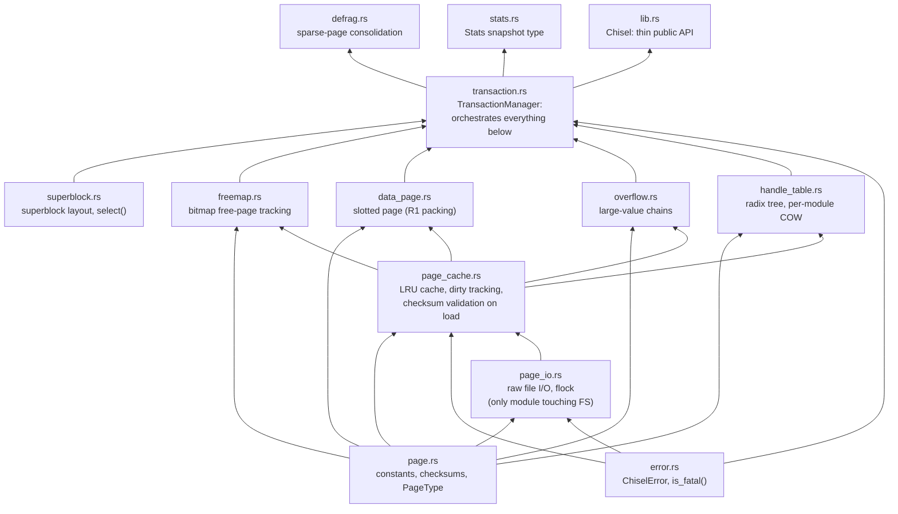
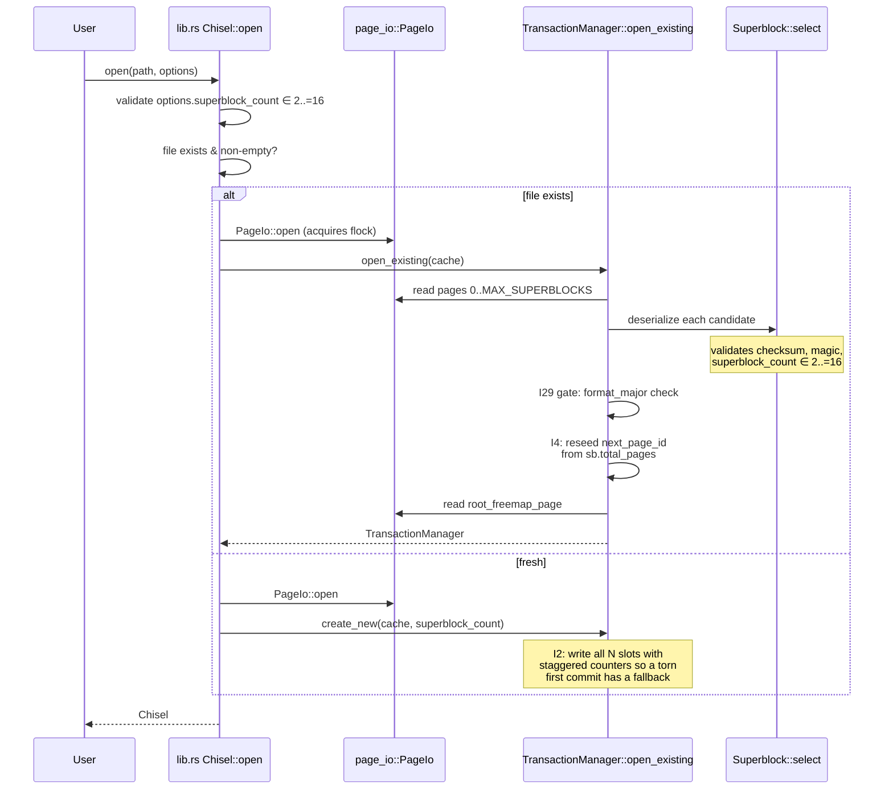
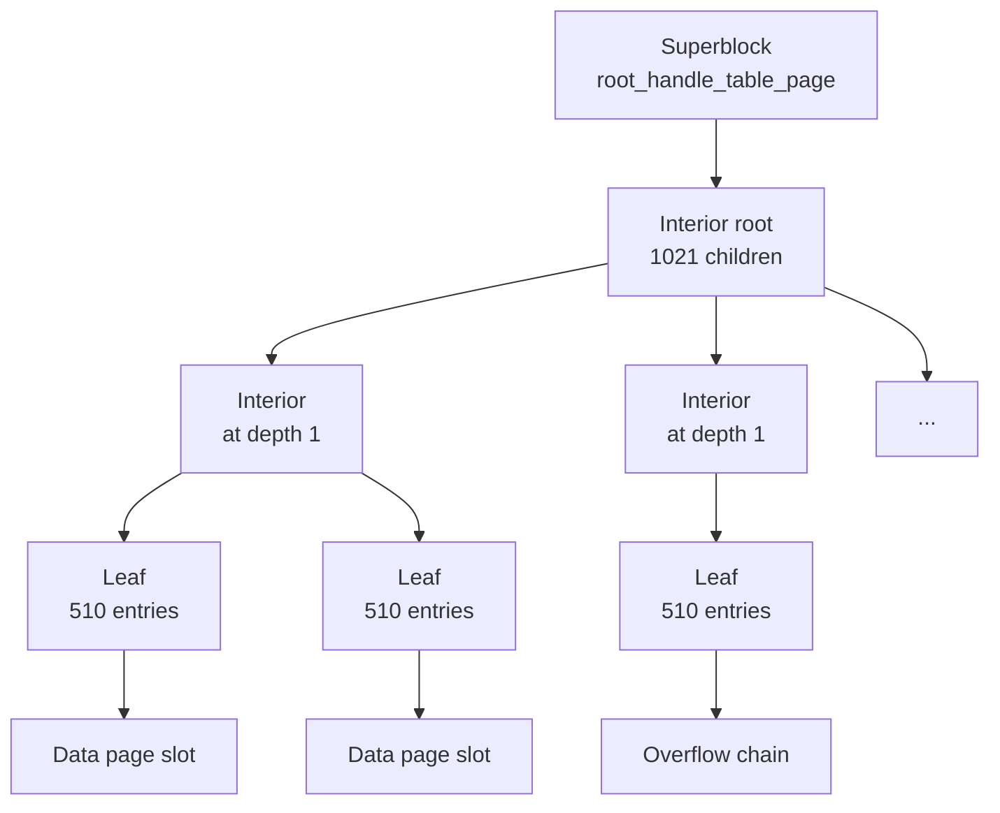

# Chisel — Architecture and On-Disk Format

This document is for someone (human or AI) reading the Chisel codebase for the first time. It explains *how* Chisel is laid out, *why* the layers stack the way they do, and what every byte on disk means. For *what Chisel does* and how to use it, see [`README.md`](README.md). For the running decision log — open issues, closed issues, every design tradeoff with date-stamped rationale — see [`ISSUES.md`](ISSUES.md).

This is a living document; update it when the architecture changes. Decisions documented here should be supportable by the code at the time you read it — if a claim and the code disagree, trust the code and update the doc.

## Table of contents

1. [Design philosophy](#design-philosophy)
2. [Layer model](#layer-model)
3. [Commit protocol](#commit-protocol)
4. [Recovery on open](#recovery-on-open)
5. [On-disk format](#on-disk-format)
6. [Cross-cutting concepts](#cross-cutting-concepts)
7. [Glossary](#glossary)

---

## Design philosophy

Three commitments shape everything else:

- **Single-writer, embedded.** Exactly one process owns the file at a time, enforced by `flock`. The Rust API is `&mut self` for every mutator; there is no internal locking, no concurrent transactions, no MVCC. This is *philosophical* (see the project memory note "Chisel single-client design is philosophical"), not a v1 simplification — the type system encodes it.
- **Shadow paging, not WAL.** Every write goes to a fresh page. The previously-committed superblock keeps pointing at the previous (intact) pages until commit swaps in a new superblock. Crash recovery is "pick the winning superblock" — there is no log to replay and no recovery procedure as such.
- **Durability over performance.** Every commit performs two `fsync` calls (data, then superblock). Every page on disk carries an XXH3 checksum validated on load. The poison model (see below) treats any `fsync` failure as terminal because Linux fsyncgate semantics make retry unsafe.

These three together explain most of Chisel's other choices (poison model, per-module COW, exclusive `flock` even for readers).

---

## Layer model

Chisel's modules form a strict bottom-up dependency graph: each layer only depends on layers below it, never sideways or upward. The diagram below is annotated with the responsibility of each module.



Why bottom-up matters: it means you can read the codebase in dependency order and never have to forward-reference. It also means a parallel review pass (which Chisel has had three of) can split across layers cleanly — see the 2026-04-22 review pass that dispatched five agents, one per layer group.

### Module responsibilities at a glance

| Layer | Module | Responsibility | Key invariant |
|---|---|---|---|
| 1 | `page.rs` | Page size, type tags, header sizes, magic, format-version constants, XXH3 checksum primitives. | `PAGE_SIZE = 8192`; checksum lives in the last 8 bytes; little-endian on disk. |
| 1 | `error.rs` | `ChiselError` enum, `is_fatal()` classifier (operational vs fatal). | Fatal variants poison the manager (I1). |
| 1 | `superblock.rs` | In-memory `Superblock` struct, `serialize`/`deserialize`, `select()` across N candidate slots. | Magic + checksum + `superblock_count ∈ 2..=16` filter slots before tie-breaking by `txn_counter`. |
| 2 | `page_io.rs` | Raw `pread`/`pwrite` of fixed-size pages, exclusive `flock`, `fsync`, in-memory `Vec<u8>` backing. Tracks cumulative successful `fsync_calls` count via a `Cell<u64>`. | The **only** module that touches the filesystem; everything else uses it through `PageCache`. |
| 3 | `page_cache.rs` | LRU cache over `PageIo`, dirty tracking, checksum validation on load, spillway overflow, and `CacheFull`/`SpillwayFull` errors. Owns three `Cell<u64>` engine-activity counters (cache hits/misses, pages allocated) and exposes `counters()` aggregating them with `PageIo::fsync_count`. | Soft eviction at `max_pages`; dirty overflow spills to a sidecar Spillway file (cap = `spillway_max_bytes`); `CacheFull` at strict `max_pages` when spillway is disabled (`spillway_max_bytes=0`); checksums verified on disk LOAD only. |
| 4 | `freemap.rs` | Bitmap of free pages, `allocate_first` / `allocate_near` / `mark_free`. | Pure buffer manipulation; no cache or I/O. |
| 4 | `data_page.rs` | Slotted page layout (R1): slot directory grows forward, packed value data grows backward, dead-slot tombstones reclaimed only by `compact()`. | Slot indices are stable until compact; compact returns an old→new mapping for callers to rewrite. |
| 4 | `overflow.rs` | Singly-linked overflow chains for values > inline threshold. | `total_length` repeated on every chain page; `next_page == 0` terminates; cycle detection bounded by `total_length / OVERFLOW_PAYLOAD` (I14). |
| 5 | `handle_table.rs` | Radix tree mapping `u64` handle → `(page_id, slot_index)`. Implements its own copy-on-write atop `PageCache::new_page`. | Capacity = `510 × 1021^depth`; `find_leaf` short-circuits on `handle ≥ capacity` to `Ok(None)` (I26). |
| 6 | `transaction.rs` | `TransactionManager`: orchestrates begin/commit/rollback, savepoints, `persist_freemap`, the commit protocol, the poison flag. | Commit protocol step ordering is load-bearing — see next section. |
| 7 | `defrag.rs` | Sparse-page consolidation; runs inside an active transaction. | `pages_examined`/`pages_freed` are page-granular (I17). |
| 7 | `stats.rs` | Two snapshot structs: `Stats` (`handle_count`, `total_pages`, `file_size_bytes`) and `ChiselCounters` (cache hits/misses, pages allocated, fsync calls — cumulative-from-open engine activity). | Both are point-in-time snapshots, not live views. `ChiselCounters` is `#[non_exhaustive]` so future counters can be added without a breaking change. |
| 8 | `lib.rs` | `Chisel` public API; thin wrapper over `TransactionManager`. | `&mut self` everywhere except `read`/`get_root_name`/`handles`/`stats`/`counters` (F3). |

---

## Commit protocol

The commit protocol is shadow paging's load-bearing part: the order of operations within `TransactionManager::commit` determines the crash-safety guarantee. Reordering any step changes what a recovering reader can observe.

```mermaid
sequenceDiagram
    participant U as User
    participant TM as TransactionManager
    participant FM as Freemap (in-memory)
    participant C as PageCache
    participant IO as PageIo (file)

    U->>TM: commit()
    Note over TM: check_alive() — refuse if poisoned
    TM->>TM: merge savepoint freed_pages<br/>into txn_freed_pages (I27)
    TM->>C: cache.flush() — drain dirty before<br/>persist_freemap can hit ceiling (I28)
    C->>IO: write_page() × N + fsync #1
    TM->>FM: persist_freemap:<br/>1) allocate new freemap page id<br/>2) merge freed pages into bitmap (I18)<br/>3) write freemap bytes via cache
    TM->>C: cache.flush() — write the<br/>new freemap page + fsync #2
    C->>IO: write_page() (freemap) + fsync
    TM->>TM: build new Superblock<br/>(txn_counter += 1)
    TM->>IO: write_page(slot = txn_counter % N)
    TM->>IO: fsync #3 — LINEARIZATION POINT
    TM->>TM: promote current_roots<br/>→ committed_roots; clear txn state
    TM-->>U: Ok(())
```

### Why each step is in this order

1. **Pre-drain flush.** `persist_freemap` calls `allocate_data_page`, which can trip `maybe_evict`'s spill-or-error decision if every cached page is dirty (nothing evictable, spillway disabled or full). `CacheFull` is operational-by-design (caller recovers via commit/rollback) but the commit wrapper poisons on any error — so a `CacheFull` raised mid-commit would silently demote operational to fatal. Pre-draining clears every dirty pin so the strict cap is reachable via normal eviction. Cost: one extra `fsync`. (See I28.)
2. **`persist_freemap` allocates BEFORE merging.** The freed pages list and the old freemap page id are both still referenced by the *currently-committed* superblock. If `persist_freemap` merged them into `current_freemap` first, `allocate_first` could return one of those ids, `claim_page` would mark it dirty, and the subsequent flush would overwrite a page the on-disk superblock still depends on. Allocating first guarantees the new page id is either already-free in the committed state or freshly extended. (See I18.)
3. **Two separate fsyncs (data + superblock).** Linux's `fsync` does not order writes within itself — the OS may write the superblock to disk before the data pages it references. Splitting into two fsyncs enforces "all data durable BEFORE superblock durable." A crash between them leaves the previous (intact) superblock active.
4. **Round-robin write to `txn_counter % N`.** The "active" superblock is whichever slot has the highest valid counter. Writing to `txn_counter % N` always targets the stalest slot; the previously-active slot stays untouched. A torn write can damage the new superblock but cannot damage any of the N-1 last-known-good ones. Higher N (configurable 2..=16) trades disk space for survival of consecutive torn-write retries. (See R4.)
5. **Promote in-memory state LAST.** Until the superblock fsync returns, the transaction is not durable. Updating `committed_roots` before that point would make in-memory state lie about durability — a subsequent reader could see uncommitted handles.

### What happens on failure at each step

| Crash window | Recovery state |
|---|---|
| Before the first flush | No durable change; the previous committed superblock is still active; the transaction is simply lost. |
| Between flush #1/#2 and persist_freemap completion | Some new pages on disk are unreferenced (orphans); the previous committed superblock still wins on next open; orphans get truncated or overwritten by the next allocation (see I4). |
| During the superblock write (slot torn) | The N-1 other slots still hold valid earlier states; `Superblock::select` ignores the torn slot (checksum fails) and picks the highest valid surviving counter. |
| Between superblock write and fsync #3 | The kernel may have buffered the new superblock; a crash here means the buffer never reached disk, recovery picks the previous superblock — transaction lost cleanly. |
| Anywhere, on `fsync` failure | The `TransactionManager` is poisoned. Per Linux fsyncgate (post-2018), a failed `fsync()` cannot be safely retried — the kernel may have discarded the dirty pages already. Recovery is `close()` + reopen, which runs the same shadow-paging recovery and returns the database to its last-durable state. (See I1.) |

---

## Recovery on open

`Chisel::open` is the entry point that handles both "fresh database" and "open existing." The "exists" check treats a zero-length file as nonexistent (lets a `touch`-then-open or a half-finished `creat(2)` go through the create path cleanly).



The format-version gate after `select` is what makes the README's "sacred within a major version" promise concrete: a file written by a future, incompatible MAJOR is rejected with `UnsupportedFormatVersion`. Same-major files (any minor) open cleanly. (See I29 for the packed-MAJOR/MINOR scheme; I31 for the per-page version byte that supports lazy upgrade within a major.)

---

## On-disk format

### File structure

A Chisel file is a sequence of fixed-size 8 KB pages. The first N pages (where `N = superblock_count`, configurable at create time, default 2) are superblock slots; everything after is data:

```text
+-----------------------------------+ offset 0
| Page 0:  Superblock slot 0        |
+-----------------------------------+ 8 KB
| Page 1:  Superblock slot 1        |
+-----------------------------------+ 16 KB
|         ... up to N-1             |
+-----------------------------------+
| Page N:  first data/HT/overflow   |
+-----------------------------------+
|         ... data pages grow       |
|             monotonically         |
+-----------------------------------+
```

Every page ends with an 8-byte XXH3 checksum over bytes `0..CHECKSUM_OFFSET` (= bytes `0..8184`). `PageCache` validates the checksum on every cache miss; cache hits skip revalidation because the in-memory bytes are trusted between writes (the exclusive `flock` keeps any other process from scribbling on the file). A checksum mismatch on load is fatal (`ChecksumMismatch`).

### Common page header

Every non-superblock page shares a common 16-byte header. Bytes 0..8 are page-type-specific; bytes 8..16 are reserved for future common-header fields (I31 reservation, 64 bits of headroom).

```text
non-superblock page (16-byte common header)

byte:    0       1       2                  8                          16
       +-------+-------+------------------+----------------------------+
       | Type  | (*)   | type-specific    | RESERVED for future        |
       | tag   |       |                  | common-header fields (I31) |
       +-------+-------+------------------+----------------------------+

(*) byte 1 is page_format_version for Data, Overflow, FreeMap;
    FLAG_LEAF/INTERIOR for HandleTable (its version sits at byte 2).
    See page::page_format_version() for the dispatch.
```

The page-format-version byte (I31) lets individual page layouts evolve within a file MAJOR without a file-wide format bump — the foundation for lazy per-page upgrade. Today every page reports version 0; future minor changes to a page-type's layout will bump that page-type's version while leaving others alone.

### Superblock pages

Superblocks have their *own* layout — they don't carry the common-header convention because they predate it and the recovery path (`Superblock::deserialize`) needs to be able to interpret them at fixed offsets without any prior context. Pages 0 through `superblock_count - 1` are superblock slots, alternated by `txn_counter % N` on commit.

```text
Superblock page

bytes        | field                              | type
-------------|------------------------------------|------------------
0..4         | magic (= 0x4348534C, "CHSL" LE)    | u32 LE
4..8         | format_version (packed MAJOR/MINOR)| u32 LE
             |   upper 16 bits = MAJOR            |
             |   lower 16 bits = MINOR            |
8..16        | txn_counter                        | u64 LE
16..24       | root_handle_table_page             | u64 LE (or PAGE_ID_NONE = u64::MAX)
24..32       | root_freemap_page                  | u64 LE (or PAGE_ID_NONE)
32..40       | total_pages                        | u64 LE
40..48       | next_handle                        | u64 LE
48..52       | page_size                          | u32 LE (= 8192)
52..308      | named_roots                        | 8 entries × 32 bytes
             |   each: 24-byte name + 8-byte handle |
308..312     | superblock_count                   | u32 LE (= N, in 2..=16)
312..8184    | reserved (zeroed for forward compat)| [u8; ~7872]
8184..8192   | XXH3 checksum                      | u64 LE
```

`Superblock::select` reads up to `MAX_SUPERBLOCKS` (= 16) candidate pages, calls `deserialize` on each (which fails fast on bad checksum / wrong magic / out-of-range `superblock_count`), and `max_by_key`s on `txn_counter`. Ties break by lowest slot index (deterministic but rare in practice — only seen during the `create_new` seeding window before the first user commit).

The `superblock_count` field being **in every slot** is what lets `open_existing` discover N at recovery time without out-of-band metadata: read the first MAX_SUPERBLOCKS pages blindly, the winning slot tells you N. Higher N (3..16) trades 8 KB per slot for survival of consecutive torn writes (see R4).

The named-root table (F2) is fixed-size — 8 entries, 24-byte names, 8-byte handles — and survives commit/rollback transactionally because it lives *in* the superblock that the commit swaps.

### Data pages

Data pages are slotted: they pack multiple values per page (R1) using a slot directory growing forward from the header and packed value bytes growing backward from the checksum. The free hole between them shrinks as inserts happen.

```text
Data page (PageType = 0x02)

bytes              | field                         | type
-------------------|-------------------------------|----------
0                  | PageType (= 0x02)             | u8
1                  | page_format_version (I31)     | u8
2..4               | slot_count                    | u16 LE
4..6               | free_start                    | u16 LE
6..8               | free_end                      | u16 LE
8..16              | reserved (I31 common region)  | [u8; 8]
16..free_start     | slot directory                | array of 6-byte entries
free_start..free_end| free hole                    | (shrinks as page fills)
free_end..8184     | packed value data             | grows backward
8184..8192         | XXH3 checksum                 | u64 LE
```

```text
visual:

0   1   2   4   6   8           16              free_start    free_end                8184  8192
+---+---+---+---+---+-----------+----------------+------+--------+-----------------+-----+
|02 |ver|cnt|fs |fe |  reserved | slot directory | free | packed value bytes      |cksum|
+---+---+---+---+---+-----------+----------------+ hole +-------------------------+-----+
                                                               (grows backward)
```

Each slot directory entry is 6 bytes: 2-byte data offset + 2-byte length + 2-byte flags (`SLOT_FLAG_LIVE = 0x0001`, `SLOT_FLAG_DEAD = 0x0000`). Slot indices are stable across `insert`/`delete`/`update` — the handle table stores `(page_id, slot_index)` and relies on this. `compact()` reclaims dead slots and returns an old→new index mapping; the transaction layer is responsible for rewriting any handle-table entries that reference a compacted page.

`free_end - free_start` is the available space; insert fails (rather than violating the invariant) if it can't fit a new entry plus its data.

### Overflow pages

Values that exceed the inline threshold (~`PAGE_BODY_SIZE`) spill into a singly-linked chain of overflow pages. The handle table's slot entry stores the first overflow page id; readers walk `next_page` until they hit a `0` terminator.

```text
Overflow page (PageType = 0x03)

bytes              | field                         | type
-------------------|-------------------------------|----------
0                  | PageType (= 0x03)             | u8
1                  | page_format_version (I31)     | u8
2..8               | reserved (type-specific)      | [u8; 6]
8..16              | reserved (I31 common region)  | [u8; 8]
16..24             | total_length                  | u64 LE  (full value size,
                   |                               |          repeated on every page)
24..32             | next_page                     | u64 LE  (0 = end of chain)
32..8184           | payload (OVERFLOW_PAYLOAD)    | [u8; 8152]
8184..8192         | XXH3 checksum                 | u64 LE
```

Repeating `total_length` on every chain page lets any page answer "how big is this value?" without walking the chain. `next_page == 0` is a safe terminator because page 0 is always a superblock — it cannot be a legitimate overflow target.

Cycle detection in `read`/`delete` bounds the walk by `total_length / OVERFLOW_PAYLOAD` (I14): a corrupt chain that loops forever cannot exceed the number of pages required to store the advertised total length, so the walker returns `CorruptPage` rather than spinning.

### Handle table pages

The handle table is a fixed-fanout radix tree. Leaf pages hold 510 16-byte `HandleEntry` records; interior pages hold 1021 8-byte child page pointers. Depth grows when insert outgrows the current tree's capacity (`grow()` stacks a new interior root above the old one, with the old root at child index 0).



Capacity at depth `d` is `510 × 1021^d`: 510 at depth 0, ~520k at depth 1, ~531M at depth 2. Lookup is `O(d)` page reads.

#### Leaf page layout

```text
Handle table LEAF page (PageType = 0x01, FLAG_LEAF = 0x01)

bytes              | field                         | type
-------------------|-------------------------------|----------
0                  | PageType (= 0x01)             | u8
1                  | FLAG_LEAF (= 0x01)            | u8
2                  | page_format_version (I31)     | u8
3..8               | reserved                      | [u8; 5]
8..16              | reserved (I31 common region)  | [u8; 8]
16..16+510*16      | 510 HandleEntry slots         | 510 × 16 bytes
                   |                               |   each entry:
                   |                               |     0..8  page_id      (u64)
                   |                               |     8..10 slot_index   (u16)
                   |                               |     10    flags        (u8)
                   |                               |     11..16 reserved
8176..8184         | reserved padding              | [u8; 8]
8184..8192         | XXH3 checksum                 | u64 LE
```

`HandleFlags` (the byte at entry-relative offset 10): `Live = 0x01` (page_id points to a data-page slot), `Overflow = 0x02` (page_id points to the first overflow chain page), `Deleted = 0x03` (tombstone — the slot stays allocated, but `lookup` reports the handle as absent). Tombstones are why handles are never reused: the slot is "burned" forever.

#### Interior page layout

```text
Handle table INTERIOR page (PageType = 0x01, FLAG_INTERIOR = 0x02)

bytes              | field                         | type
-------------------|-------------------------------|----------
0                  | PageType (= 0x01)             | u8
1                  | FLAG_INTERIOR (= 0x02)        | u8
2                  | page_format_version (I31)     | u8
3..8               | reserved                      | [u8; 5]
8..16              | reserved (I31 common region)  | [u8; 8]
16..16+1021*8      | 1021 child page pointers      | 1021 × u64 LE
                   |   (0 = "no child allocated";  |
                   |    safe sentinel because page |
                   |    0 is always a superblock)  |
8184..8192         | XXH3 checksum                 | u64 LE
```

The "0 child = unallocated" sentinel relies on page 0 being a superblock and therefore never a handle-table page (I8). The descent loop in `find_leaf` short-circuits to `Ok(None)` when it sees a 0 child, and also when the requested handle is `>= capacity()` (I26 — without that bounds check, the offset arithmetic walked into the checksum bytes).

The flag byte at position 1 is forensic-only — no runtime code reads `FLAG_LEAF`/`FLAG_INTERIOR`; the depth walk uses child-pointer presence instead. The flag is kept because a hex-dump reader can use it to tell leaf from interior at a glance.

### Freemap pages

A freemap page is a bitmap: each bit represents one page in the file (`1` = free, `0` = in use). One freemap page tracks `PAGE_BODY_SIZE × 8 = 65,344` pages (~512 MB at 8 KB pages); a multi-page freemap is not yet implemented but the layout is forward-compatible (a future extension would chain freemap pages or store an index page).

```text
FreeMap page (PageType = 0x04)

bytes              | field                         | type
-------------------|-------------------------------|----------
0                  | PageType (= 0x04)             | u8
1                  | page_format_version (I31)     | u8
2..8               | reserved (type-specific)      | [u8; 6]
8..16              | reserved (I31 common region)  | [u8; 8]
16..8184           | bitmap body                   | [u8; 8168] = 65344 bits
                   |   bit_position(page_id):      |
                   |     byte_idx = page_id / 8    |
                   |     bit_idx  = page_id % 8    |
                   |   1 = free, 0 = in use        |
8184..8192         | XXH3 checksum                 | u64 LE
```

`allocate_first` returns the lowest free page id by scanning bytes for non-zero values and using `trailing_zeros` to find the bit. `allocate_near(target)` does an outward radius scan from a hint, useful for keeping logically-related pages spatially close (currently used by data-page allocation only opportunistically).

The freemap is consumed during commit's `persist_freemap`: pages freed during the transaction are merged into the bitmap **after** the new freemap page has been allocated (I18 — see commit-protocol section).

---

## Cross-cutting concepts

### Handle stability

A handle is a `u64` returned by `allocate()`. Handles are assigned monotonically from `next_handle` (a counter in the superblock) and **never reused** within a database's lifetime, even after delete. Delete writes a tombstone (`HandleFlags::Deleted`) into the leaf entry; the slot stays allocated, the page stays valid, but `lookup` reports `Ok(None)` and the user-facing API returns `InvalidHandle`. This permanent-burn policy is what makes handles safe to embed in long-lived references (e.g., from another data structure or another database) without worrying about a stale handle pointing at unrelated data after a delete-and-realloc cycle.

The radix-tree indirection means values can move freely on disk — `update()` to a larger value, `defrag()` consolidation, future page-format upgrades — without changing the handle the caller holds.

### Per-module copy-on-write

Chisel does not have a centralized COW abstraction. Each layer-4 / layer-5 module that mutates pages (handle_table, freemap during persist) implements COW by allocating fresh pages via `PageCache::new_page`, writing the new state into the new pages, and returning the new root id to the caller. The previously-committed page is left untouched on disk; it remains valid and reachable through the previously-committed superblock for the entire duration of the new transaction.

This per-module pattern is deliberate. A monolithic COW abstraction was considered and rejected — it would have forced every page-type module to express its mutations through a uniform interface, and the modules' actual COW shapes are different enough (handle table walks a tree; freemap rewrites one page; data pages reuse the same page across multiple commits via `claim_page`) that a generic interface would have leaked detail.

### Spillway

The page cache enforces a strict cap (`Options::cache_max_bytes`). When the cache is full and every entry is dirty (so nothing is evictable), overflow dirty pages spill to a sidecar file `<db_path>.spillway` rather than returning `CacheFull`. The spillway is bounded by `Options::spillway_max_bytes` (default `1024 × cache_max_bytes` = 8 GiB at the 8 MiB cache default); `SpillwayFull { limit_bytes }` fires when both the cache and the spillway are exhausted. Setting `spillway_max_bytes = 0` disables the spillway and restores `CacheFull`-at-cap semantics.

Spillway slots carry their own per-slot XXH3 checksum over `page_id || page_bytes`, distinct from the main-file page checksum, so a corrupt spillway slot is detected on rehydrate. The spillway is never `fsync`ed — its content does not need to survive a crash; it's truncated at open and at every commit/rollback. A crash with a non-empty spillway just discards its contents on the next open, which is correct because anything in the spillway was uncommitted dirty state.

The no-spill commit cost is **3 fsyncs**: pre-drain flush (I28) + main-pages flush + superblock. The pre-drain handles a subtle interaction in the commit protocol (see [Commit protocol](#commit-protocol) step 1).

### Slot packing and overflow

Values up to `MAX_INLINE_VALUE` (~`PAGE_BODY_SIZE`) are stored inline in a data-page slot. Larger values get an overflow chain; the slot directory entry then points at the first chain page id with `HandleFlags::Overflow` set, and the data-page slot contains the chain head pointer rather than the value itself.

Slot packing (R1) means a single data page can hold many small values; freed slots become tombstones until `compact()` reclaims the space. Compact is invoked by `defrag()` (R3), which selectively rewrites pages whose live-slot count falls below a threshold.

### Freemap reclamation

Free pages enter the freemap during commit's `persist_freemap`: the transaction's `txn_freed_pages` (collected from `delete()` calls) and the previous freemap's own page id are merged into the new freemap snapshot. Subsequent transactions then prefer freemap-reuse over file extension when allocating new data pages — `allocate_data_page` tries `FreeMap::allocate_first` first, falls back to `cache.new_page` if the freemap is empty.

There is one carve-out: freemap-reuse is disabled while any savepoint is active (`allocate_data_page` checks `savepoints.is_empty()`). The reason is that a `rollback_to` would need a per-savepoint freemap snapshot to correctly restore reuse decisions; the v1 simplification is "no reuse during savepoint scopes," which keeps the rollback path simple. Workloads that want reuse don't typically use savepoints.

Overflow pages and handle-table COW pages do *not* go through `allocate_data_page` (they call `cache.new_page` directly and always extend), but their *frees* still feed the freemap on commit, so delete-heavy workloads still reach equilibrium via data-page reuse.

### Named roots

A small fixed-size table in the superblock mapping short string names to handles, intended for long-lived entry points (e.g. a meta-B-tree root, a schema descriptor). Changes are transactional because the table lives *in* the superblock that commit swaps — `set_root_name` writes to the in-memory `Roots` snapshot, the snapshot becomes durable on commit, and `rollback`/`rollback_to` reverts it.

The fixed table size (8 entries × 32-byte slots) is intentional: it keeps the superblock layout simple and bounds the cost of carrying named roots across every commit. If more named roots are needed in the future, the table size is a candidate for a minor-version field bump (within the I29/I31 framework).

### Defragmentation

`defrag()` consolidates sparse data pages: it identifies pages whose live-slot count falls below a threshold and re-inserts their live values, freeing the source pages for reclamation. Defrag runs *inside* an active transaction so it composes with other work and is atomic on commit — this is intentional, not an oversight; the alternative ("auto-begin / auto-commit") would have made defrag impossible to schedule alongside a larger maintenance batch.

The cap parameter (`DefragOptions::max_pages`) bounds the number of *values* relocated in one pass, despite the legacy name (kept for API stability; see C4 in ISSUES.md).

### Poison model

On any fatal error — an `IoError` from `fsync`, a `ChecksumMismatch` on a page load, a `CorruptSuperblock` on open, any error raised after the commit protocol has begun — the `TransactionManager` becomes **poisoned**. Every subsequent call returns `ChiselError::Poisoned`, including reads. The only legal recovery is to drop the `Chisel` handle and call `Chisel::open` again; the shadow-paging recovery path then returns the database to its last-durable state.

This mirrors `std::sync::Mutex` poisoning. It is mandatory because Linux fsyncgate (post-2018) makes retrying a failed `fsync()` unsafe — the kernel may have discarded the dirty pages already, and a subsequent successful `fsync()` does not mean earlier data is durable. The reopen-to-recover idiom exercises the same code path as crash recovery, which has the side benefit of testing the recovery path on every real-world poison event. (See I1 for the full design and I29 for what `UnsupportedFormatVersion` means under the packed scheme.)

### Engine-activity counters

`Chisel::counters()` returns a `ChiselCounters` snapshot of four cumulative-from-open counters: `cache_hits`, `cache_misses`, `pages_allocated`, and `fsync_calls`. Each counter is a `Cell<u64>` living at the site that increments it (`PageCache` for the first three, `PageIo` for fsync), and `PageCache::counters()` aggregates them into a single struct read via `PageIo::fsync_count()`.

Three semantic conventions matter:

- **Counters reset on close + reopen**, because `PageCache` and `PageIo` are reconstructed. There is no persistent counter state on disk — the in-memory `Cell<u64>` is the entire record.
- **Misses, allocations, and hit increments record *attempts*, not successes.** `cache_misses` is incremented before `load_page` (so a checksum-mismatch error still records the miss); `pages_allocated` is incremented before `maybe_evict` (so a `CacheFull` allocation still records the attempt). `fsync_calls` is the asymmetric exception: it counts only *successful* fsyncs, because a failed fsync poisons the engine (I1) and the counter on a poisoned engine has no defined further meaning.
- **Reads via `Chisel::counters()` are `&self`** and do not mutate. The bench harness reads counters before and after a measurement and reports the delta; that's the primary intended consumer, but the counters are also useful for ad-hoc debugging ("how many cache misses did this query cause?").

The counter set is fixed at four for v1 of the instrumentation (PR 1 of the bench-suite series). `#[non_exhaustive]` on `ChiselCounters` keeps the door open for adding a fifth counter later without a breaking change.

### Format versioning (two-tier)

Chisel versions its on-disk format at two levels.

- **File level** (I29): the superblock carries a packed `format_version` u32 — upper 16 bits MAJOR, lower 16 bits MINOR. Open-time gate compares MAJOR only. Any same-major file opens regardless of minor; a different-major file is rejected with `UnsupportedFormatVersion`. This is what makes the README's "sacred within a major version" promise enforceable.
- **Page level** (I31): each non-superblock page carries a one-byte `page_format_version` in its header (byte 1 for Data/Overflow/FreeMap; byte 2 for HandleTable, where byte 1 holds the FLAG byte). This lets individual page layouts evolve within a major without a file-wide bump. The current value is `0` everywhere. The post-1.0 upgrade plan is lazy migration: reads dispatch on the version byte, writes always produce the latest version, and an opt-in eager upgrader (deferred) sweeps remaining old pages.

Both schemes leave reserved space for forward compatibility — the superblock has bytes 312..8184 reserved (a lot of headroom), and every non-superblock page has bytes 8..16 reserved (8 bytes / 64 bits) for future common-header fields.

---

## Benchmark infrastructure

The `bench/` subcrate is a sibling to `python/`, not a workspace member of the root `chisel` crate. It provides three measurement layers comparing Chisel against [redb](https://github.com/cberner/redb) and SQLite:

1. **Cross-engine equivalence tests** — five scenarios × three engines × snapshot/restore checks, asserting that all three engines produce identical observable state for the same workload. Catches semantic divergence in the workload-replay machinery before it contaminates measurement.
2. **Criterion micro-grid** — six rows of small-scoped operations (single-tx allocate, point-read, single-tx update at small batch sizes), 165 cells of wall-clock + file-size + Chisel-internal-counter metrics. Drives the `Engine` trait through tight loops.
3. **YCSB-style scenario tier** — four end-to-end workloads (YCSB-A 50/50 read/update Zipfian; YCSB-B 95/5 read-heavy Zipfian; Mutation Log 25/25/25/25 alloc/read/update/delete uniform; Document Store 70/20/10 read/alloc/update with log-normal sizes). Timed with `Instant::now()` rather than Criterion — Criterion's many-samples-per-bench model exceeds the 1-6 minute scenario budget.

A post-processor (`chisel-bench-summarize`) reads scenario metrics + Criterion archive data and emits three artifacts: per-cell `summary.md`, flat `results.json` (composite-key schema for the CI diff binary), and `cross-engine.md` (a per-metric Chisel/redb/SQLite comparison: throughput, p99 latency, file size). A diff binary (`chisel-bench-diff`) consumes two `results.json` files and posts a sticky regression-report comment on each PR.

### macOS fsync semantics

On macOS, Chisel calls `fcntl(F_FULLFSYNC)` via Rust's `sync_all` — durable through the disk's write cache. SQLite's default `fsync()` on macOS only flushes to the disk's write cache without `F_FULLFSYNC`, so unmodified `SqliteEngine` runs ~3 orders of magnitude faster than `ChiselEngine` on `Strict` durability. The bench harness closes this gap by issuing `PRAGMA fullfsync=ON` in `SqliteEngine::open_file` for `Strict` mode (no `#[cfg(target_os)]` gate — Linux ignores the pragma). With the fix, both engines pay the same per-commit `F_FULLFSYNC` cost on macOS, and Linux runs are unchanged.

Without the fix, comparing chisel-strict vs sqlite-strict on macOS measures Apple-vs-Apple disk-cache semantics, not engine performance. With the fix, the comparison reflects the engines themselves.

### Counter-driven measurement

Engine activity is observable via `Chisel::counters()` (cumulative-from-open: cache hits/misses, pages allocated, fsyncs). The micro-grid records counter snapshots before/after each cell so the post-processor can attribute throughput differences to fsync count, cache pressure, or page-allocation rate. This is why `ChiselCounters` is `#[non_exhaustive]` — the bench harness reads these via the public API, but additional counters can be added without a breaking change.

The asymmetry "fsync_calls counts only successes; everything else counts attempts" matters here: a `CacheFull` allocation still bumps `pages_allocated`, but a failed fsync poisons the engine and stops counter increments. The bench harness handles poisoning by aborting that cell rather than fudging the numbers.

---

## Glossary

- **COW (copy-on-write)** — every mutation writes to a fresh page rather than modifying an existing one. The previously-committed page stays valid until the superblock swap promotes the new state.
- **Handle** — a stable `u64` returned by `allocate()`. Survives `update()`, `defrag()`, and reopen.
- **HandleEntry** — the 16-byte record in a handle-table leaf describing one handle's `(page_id, slot_index, flags)`.
- **Inline value** — a value small enough to live in a data-page slot directly. Larger values overflow.
- **Linearization point** — the moment a transaction becomes durable. For Chisel, this is the return of the superblock `fsync` (commit step 4).
- **Operational error** — a `ChiselError` variant indicating the caller made a mistake or hit a transient condition; the database is fine. `is_fatal()` returns false.
- **Overflow chain** — a singly-linked sequence of overflow pages holding one large value. Owned exclusively by one handle.
- **PAGE_ID_NONE** — `u64::MAX`. Sentinel meaning "not yet allocated" for root pointers (handle-table root, freemap root).
- **PageType** — the 1-byte tag at offset 0 of every non-superblock page. Values: `0x01` HandleTable, `0x02` Data, `0x03` Overflow, `0x04` FreeMap. `0x00` is reserved so a zeroed page cannot masquerade as a valid type.
- **Poison** — the state a `TransactionManager` enters after any fatal error. Every subsequent call returns `Poisoned` until the handle is dropped and the database reopened.
- **Shadow paging** — the durability technique Chisel uses: writes go to new pages; commit swaps a superblock pointer; old state stays intact for crash recovery.
- **Slot packing (R1)** — multiple values per data page. Each value occupies one slot; the slot directory grows forward and value data grows backward from the page's checksum.
- **Slot tombstone** — a slot directory entry with `SLOT_FLAG_DEAD`. Reclaimed by `compact()`, not reused by `insert()`.
- **Superblock** — the page (one of N slots at the file head) that names the current handle-table root, freemap root, named roots, and durability metadata. Picked by `Superblock::select` on open.
- **Tombstone (handle)** — a `HandleEntry` with `HandleFlags::Deleted`. The slot stays allocated; the handle is permanently retired (never reused). See "permanent-burn policy" in [Handle stability](#handle-stability).
- **txn_counter** — monotonically-increasing u64 in every committed superblock. Used by `select` to pick the winner across slots and by the round-robin to decide which slot to write next.
- **Watermark rollback (I3)** — the rollback strategy: cache + file are truncated to `committed_roots.total_pages`. Pages allocated during the transaction (id ≥ watermark) get dropped; freemap-reused pages (id < watermark) get their dirty cache entries discarded. No undo log.
